# SQLBolt Exercises

Welcome to the SQLBolt exercises repository! This repository contains screenshots of task completion acknowledgements for various SQL lessons from the SQLBolt tutorial series.

## Table of Contents

1. [Lesson 1: SELECT Queries 101](SQL_Task_01.png)
    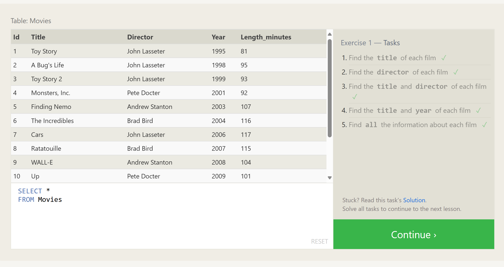

2. [Lesson 2: Queries with Constraints (Pt. 1)](SQL_Task_02.png)
    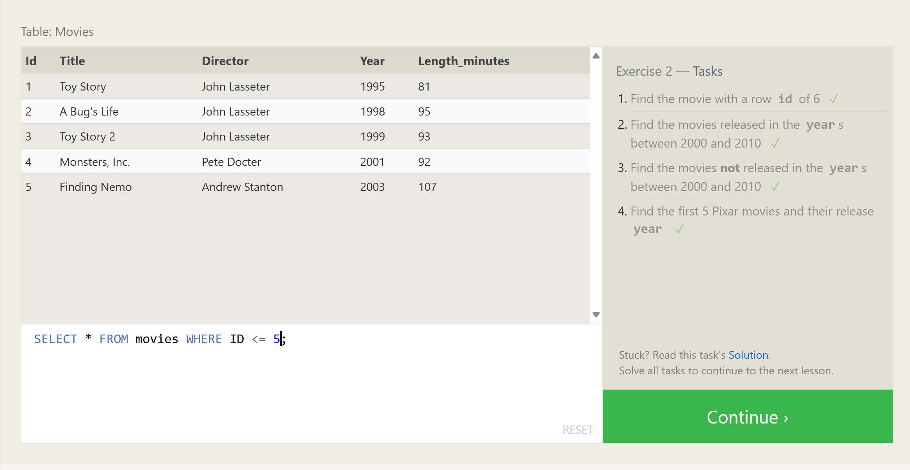

3. [Lesson 3: Queries with Constraints (Pt. 2)](SQL_Task_03.png)
    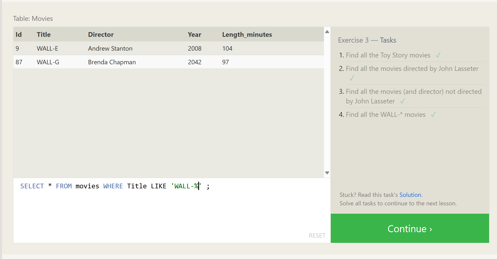

4. [Lesson 4: Filtering and Sorting Query Results](SQL_Task_04.png)
    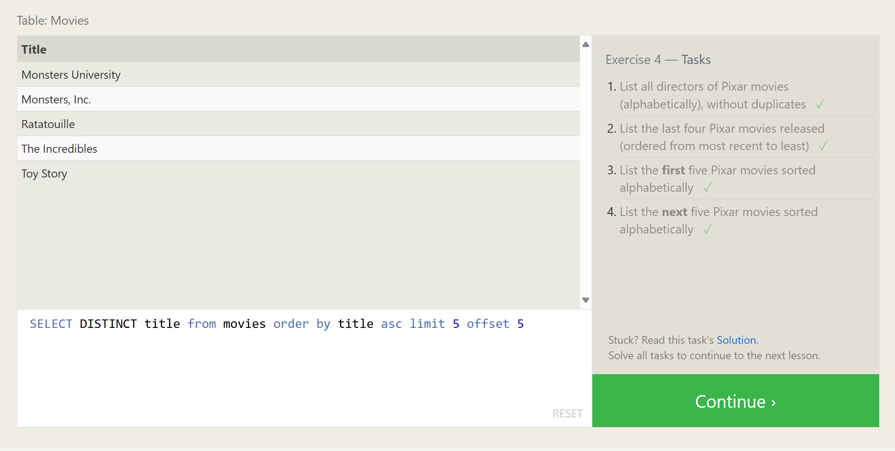

5. [Review: Simple SELECT Queries](SQL_Task_05.png)
    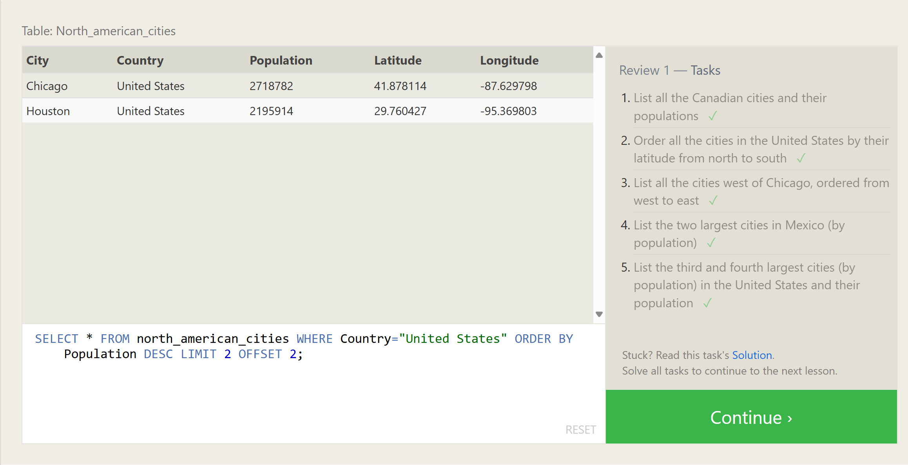

6. [Lesson 6: Multi-table Queries with JOINs](SQL_Task_06.png)
    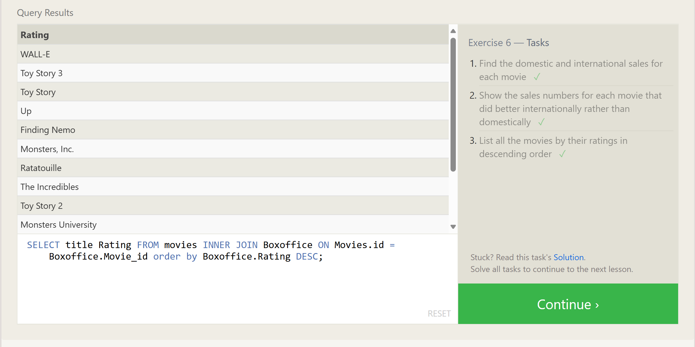

7. [Lesson 7: OUTER JOINs](SQL_Task_07.png)
    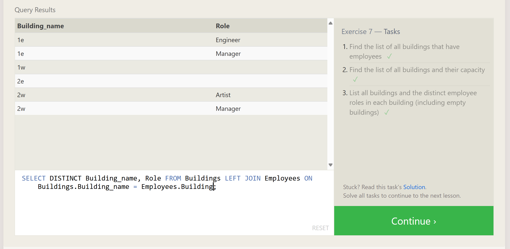

8. [Lesson 8: A Short Note on NULLs](SQL_Task_08.png)
    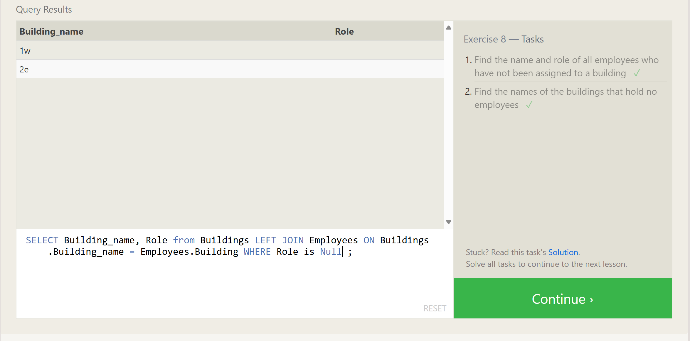

9. [Lesson 9: Queries with Expressions](SQL_Task_09.png)
    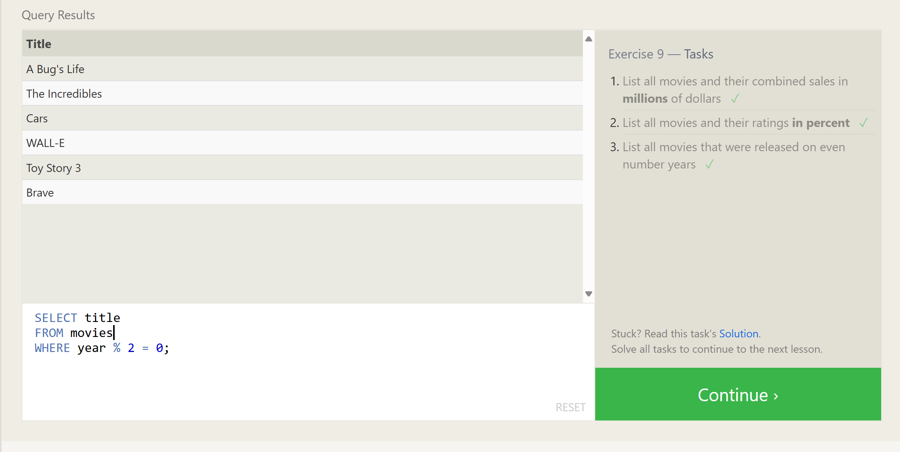

10. [Lesson 10: Queries with Aggregates (Pt. 1)](SQL_Task_10.png)
    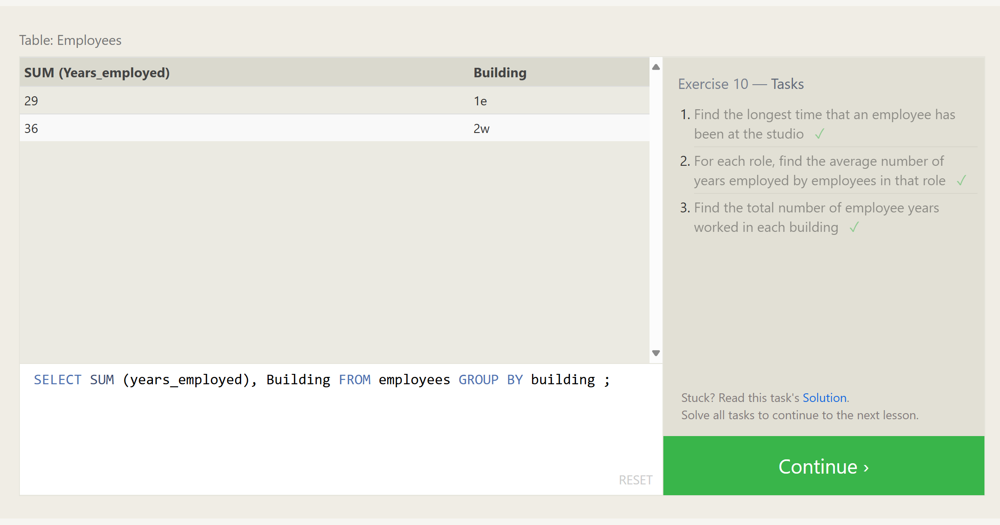

11. [Lesson 11: Queries with Aggregates (Pt. 2)](SQL_Task_11.png)
    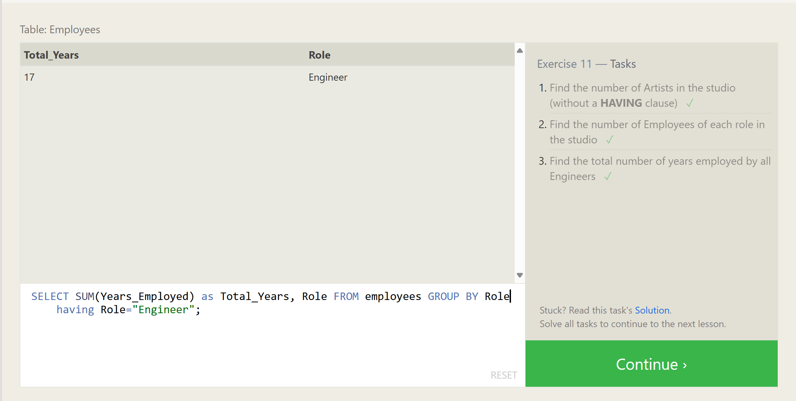

12. [Lesson 12: Order of Execution of a Query](SQL_Task_12.png)
    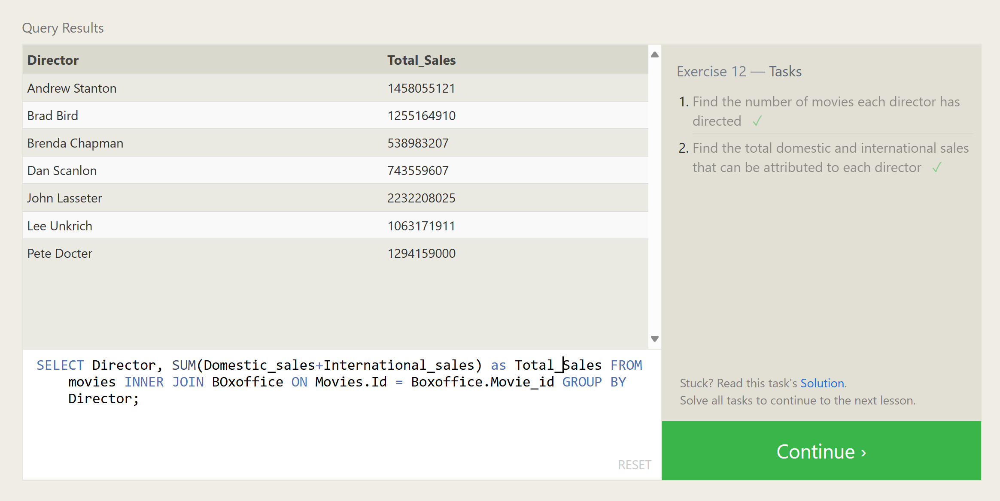

13. [Lesson 13: Inserting Rows](SQL_Task_13.png)
    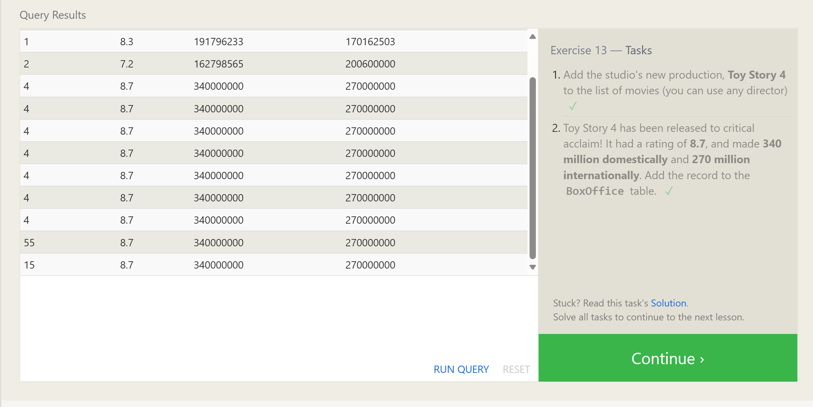

14. [Lesson 14: Updating Rows](SQL_Task_14.png)
    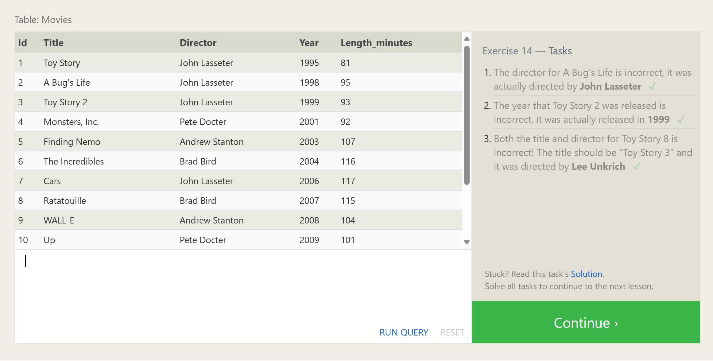

15. [Lesson 15: Deleting Rows](SQL_Task_15.png)
    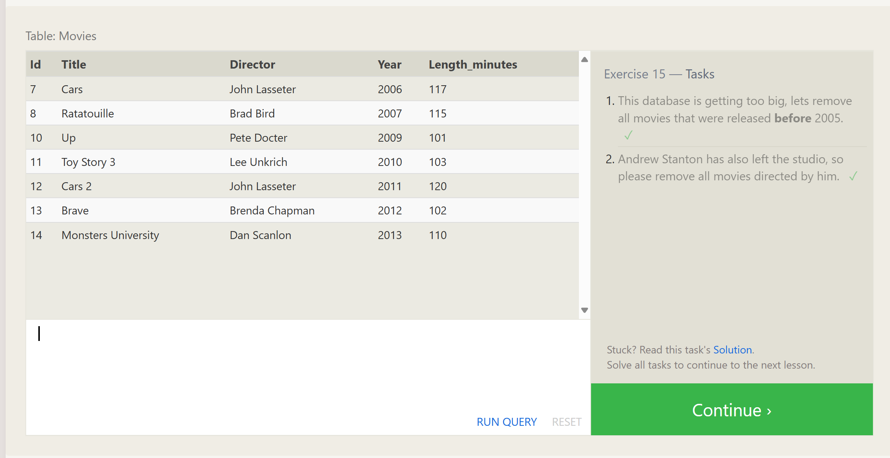

16. [Lesson 16: Creating Tables](SQL_Task_16.png)
    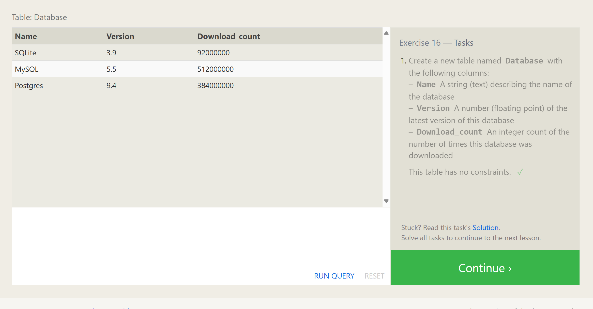

17. [Lesson 17: Altering Tables](SQL_Task_17.png)
    

18. [Lesson 18: Dropping Tables](SQL_Task_18.png)
    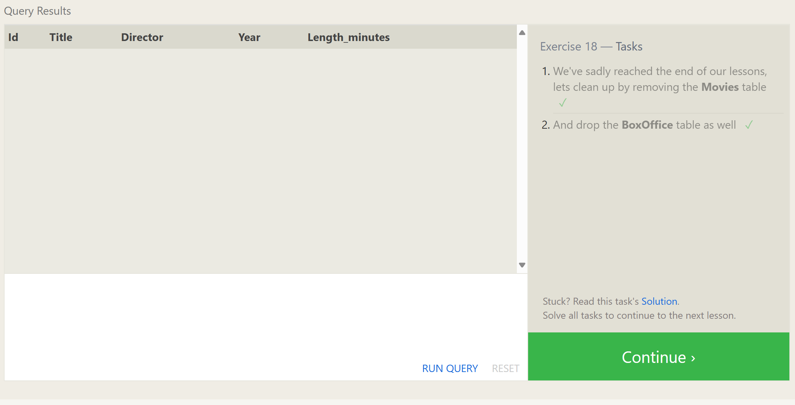
